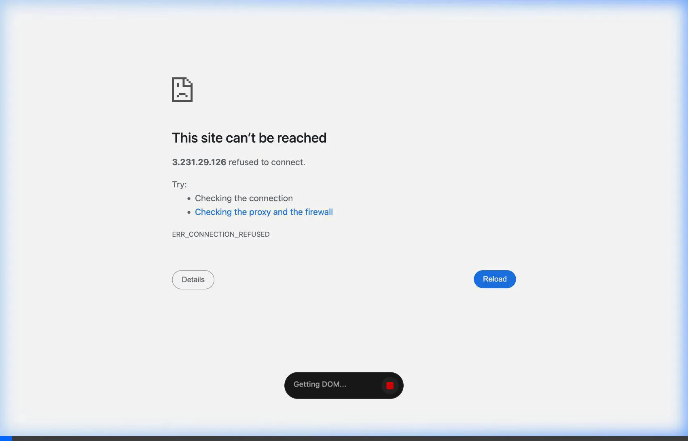
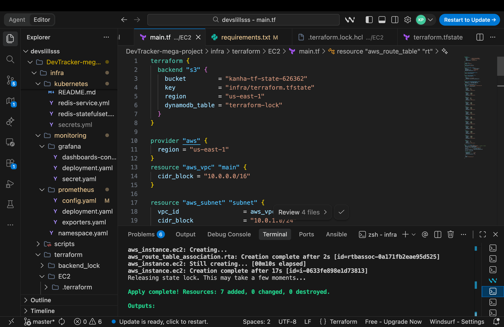
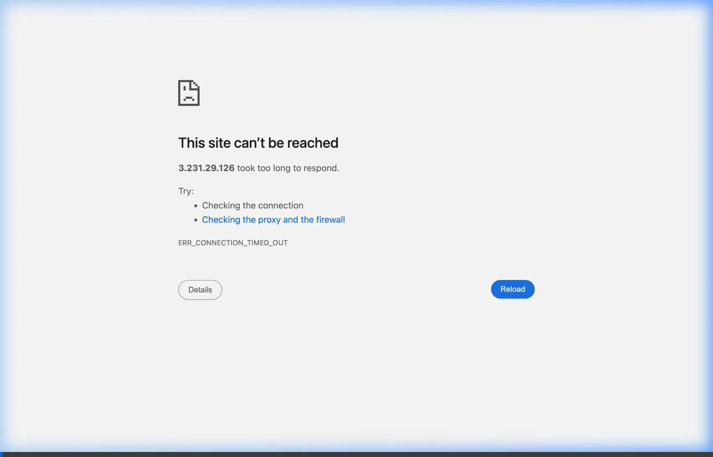
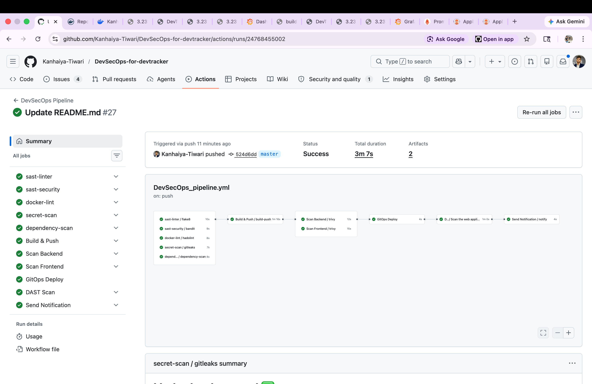
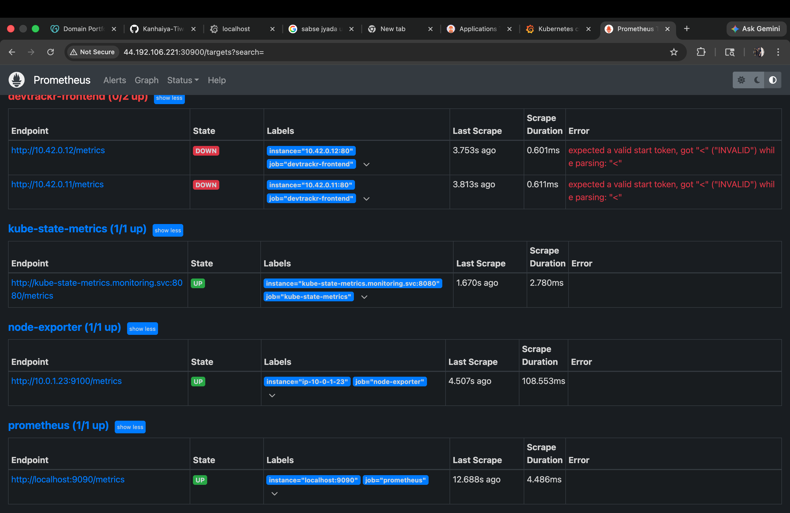
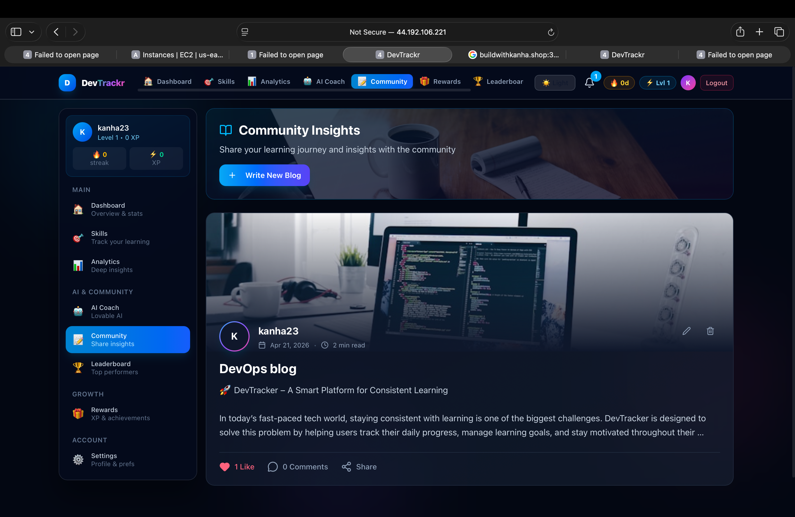
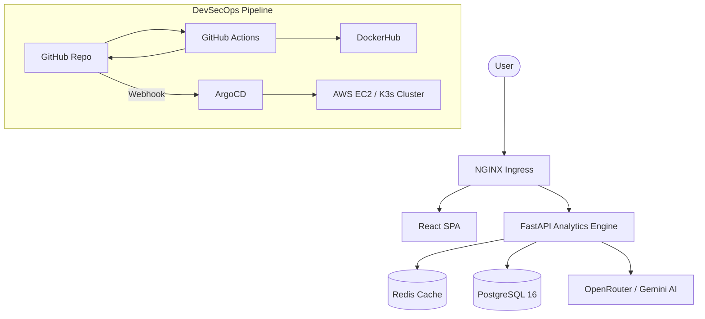

# 🚀 DevTrackr: Production-Grade DevSecOps & AI-Powered Skill Execution

<p align="center">
  
  
  
  
  
  
  
  
</p>

**DevTrackr** is not just a skill tracker—it is a **Production-Grade DevSecOps showcase**. It combines a high-performance React/FastAPI stack with a self-healing GitOps deployment model, automated security gates, and AI-powered behavior analysis.

---

## 📸 System Showcase

### 📊 Intelligent Dashboard

*Real-time skill telemetry, XP gamification, and AI-driven coaching insights.*

### 🛠️ Infrastructure as Code (Terraform)

*Automated provisioning of AWS resources with state locking and security group isolation.*

### 🔄 GitOps Operations (ArgoCD)

*Automated synchronization loop: GitHub Commits → AWS EC2 Deployment.*

### ⛓️ DevSecOps Pipeline Graph

*Full CI/CD lifecycle including Linting, SAST, SCA, Building, Scanning, and Deploying.*

### 📈 Real-time Monitoring (Prometheus)

*Active metric scraping and health monitoring of Kubernetes pods and host nodes.*

### ✍️ Community & Insights

*Integrated blog and community platform for sharing learning journeys and progress.*

---

## 🏗️ High-Level Architecture



---

## 🛡️ The DevSecOps "Gold Standard" Pipeline

This project implements a professional, multi-stage CI/CD pipeline designed to protect production environments from vulnerabilities.

### 1. 🔍 Shift-Left Security (Lint Stage)
Every pull request is scrutinized using:
- **SAST**: `Flake8` & `Bandit` for Python security.
- **SCA**: Dependency scanning for known CVEs.
- **Secrets**: `Gitleaks` to prevent API key leaks.
- **Container**: `Hadolint` for Dockerfile best practices.

### 2. 🏗️ Immutable Infrastructure (Build Stage)
- We use **Immutable Tagging**: Images are tagged with the specific **Commit SHA**, not `latest`.
- **Integrity Check**: Docker images are verified for build consistency.

### 3. 🛡️ Hardened Quality Gates (Scan Stage)
- **Trivy Critical Gate**: The pipeline **automatically FAILS** if High or Critical vulnerabilities are found in the built images. No insecure code ever reaches the registry.

### 4. 🔄 True GitOps (Deploy Stage)
- **Manifest Automation**: The pipeline programmatically updates Kubernetes deployment YAMLs with the new Commit SHA.
- **ArgoCD Integration**: Once the manifest is updated in Git, ArgoCD automatically reconciles the state on the AWS EC2 instance. **Zero manual CLI commands for deployment.**

### 🕵️ DAST & Observability
- **OWASP ZAP**: Dynamic scanning against the live endpoint.
- **Prometheus/Grafana**: 20+ panel dashboard tracking server health in real-time.

---

## 🧠 Core Features

- **AI Coaching Engine**: Personalized learning suggestions and burnout detection using OpenRouter.
- **Gamification Logic**: Complex XP curves, streak multipliers, and global leaderboards.
- **Behavioral Insights**: Analyzes your learning patterns to predict completion dates.
- **Infrastructure as Code**: Entire AWS environment (VPC, EC2, SG) managed via Terraform.
- **Configuration Management**: Fully automated node preparation with Ansible.

---

## 🚀 Getting Started

### Prerequisites
- Docker & Docker Compose
- AWS CLI (for production deploy)
- Terraform & Ansible

- [Docker Desktop](https://www.docker.com/products/docker-desktop/)

### Run

```bash
# Clone the repository
git clone https://github.com/Kanhaiya-Tiwari/DevSecOps-for-devtracker.git

# Launch local ecosystem
cd infra
docker compose up -d
```

### Production Deployment
```bash
# 1. Provision Infrastructure
cd infra/terraform/EC2
terraform apply -auto-approve

# 2. Let Ansible/ArgoCD handle the rest
# The pipeline will auto-trigger on your first push!
```

---

## 📊 Monitoring Console

Accessible via Ingress setup on your AWS Public IP:
- **Grafana**: `http://<IP>/grafana`
- **Prometheus**: `http://<IP>/prometheus`
- **ArgoCD UI**: `http://<IP>:30443`

---

## Deployment (Ansible + k3s)

The EC2 instance automatically runs the Ansible playbook via userdata script. The playbook handles:

### Automated Deployment Flow

1. **System Setup** - Update packages, install dependencies
2. **k3s Installation** - Lightweight Kubernetes with TLS SAN for public IP
3. **kubectl & Helm** - Install Kubernetes tools
4. **NGINX Ingress** - Install ingress controller
5. **Application Deploy** - Apply all Kubernetes manifests
6. **Monitoring Stack** - Deploy Prometheus & Grafana

### Manual Deployment (if needed)

If you need to manually deploy after SSH into EC2:

```bash
cd /home/ubuntu/DevTracker-mega-project/infra/ansible
ansible-playbook playbook-ec2.yml
```

### Kubernetes Namespace

All resources are deployed in the `devtracker` namespace.

### Key Features

| Feature | Details |
|---------|---------|
| Replicas | Backend: 2 · Frontend: 2 |
| Rolling Updates | Zero-downtime deployments |
| Health Checks | Liveness + readiness probes on all services |
| StatefulSet | PostgreSQL with 10Gi persistent volume (dynamic provisioning) |
| Redis | StatefulSet with 2Gi persistent volume |
| Ingress | Domain-based routing via NGINX Ingress Controller |

---

## Monitoring (Prometheus + Grafana)

### Prometheus

Scrapes metrics from:

- **DevTrackr Backend** — FastAPI request/response metrics (namespace: devtracker)
- **DevTrackr Frontend** — Nginx status (namespace: devtracker)
- **Node Exporter** — Host CPU, memory, disk
- **kube-state-metrics** — Pod, deployment, HPA states
- **cAdvisor** — Container resource usage

**Alert Rules:** BackendDown · HighErrorRate (>5%) · HighLatency (P95 >2s) · PodCrashLooping · HighMemory (>90%) · HighCPU (>80%) · PostgresDown · RedisDown

### Grafana Dashboard (20 Panels)

| Row | Panels |
|-----|--------|
| Health | Backend up/down · Frontend up/down · Pod count · Active alerts · Node count · Uptime % |
| Traffic | HTTP req/s by method · Error rate (4xx/5xx) |
| Latency | P50/P95/P99 response time · Requests by endpoint |
| Backend Resources | CPU · Memory · Pod restarts |
| Frontend Resources | CPU · Memory |
| Node Resources | Node CPU · Node memory · Node disk |
| Autoscaling | HPA desired vs current (backend + frontend) |

### Deploy Monitoring

Monitoring is automatically deployed by the Ansible playbook. Manual deployment:

```bash
kubectl apply -f infra/monitoring/namespace.yaml
kubectl apply -f infra/monitoring/prometheus/
kubectl apply -f infra/monitoring/grafana/
```

Access: Port-forward to access Grafana locally or configure ingress for domain access. Default login: `admin` / (set in `grafana-secret.yaml`)
